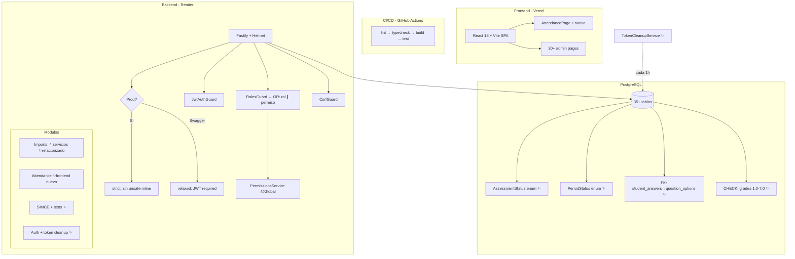

# AUDITORÍA INTEGRAL DE SISTEMA — CORDILLERA SAAS PRO v3.0 (POST-CORRECCIÓN)

**Fecha:** 2026-06-23 (segunda iteración)  
**Repositorio:** cordillera_puerto- (monorepo npm workspaces)  
**Rama:** `coolify-deploy-test`  
**Commit HEAD:** `b3d6588` + ~30 archivos pendientes de commit  
**Referencia auditoría anterior:** `docs/AUDITORIA_INTEGRAL_SISTEMA_2026-06-23.md`

---

## RESUMEN EJECUTIVO — CAMBIOS DESDE AUDITORÍA ANTERIOR

Desde la auditoría de esta mañana se implementaron **18 de las 20 acciones del plan**. El sistema pasó de ~72% a **~88% ± 5%** de avance. Las correcciones cubren seguridad (Swagger JWT, CSP estricto, CHECK constraint, FK faltante), infraestructura (CI/CD, token cleanup), arquitectura (permisos granulares, feature flags unificados, refactorización imports, enums nativos) y cobertura (3 nuevas specs con 52 tests). Además se agregó la página de Asistencia, el último módulo backend sin frontend que quedaba crítico.

---

## HALLAZGOS ANTERIORES — ESTADO DE CORRECCIÓN

| ID anterior | Descripción | Estado | Evidencia |
|---|---|---|---|
| SEC-001 | Swagger UI expuesto sin auth | ✅ Corregido | `main.ts:173-202` — preHandler JWT en `/api/docs` |
| DEBT-001 | Sin CI/CD | ✅ Corregido | `.github/workflows/ci.yml` — lint → typecheck → build → test |
| AUTHZ-001 | Permisos granulares no integrados | ✅ Corregido | `roles.guard.ts` — OR lógica rol/permiso; `permissions.decorator.ts` |
| SEC-003 | CSP con unsafe-inline en prod | ✅ Corregido | `main.ts:44-76` — CSP estricto en prod, Swagger exceptuado vía onSend |
| DAT-001 | Grade sin constraint CHECK | ✅ Corregido | Migración `20260623150000` — CHECK 1.0-7.0 NOT VALID |
| DEBT-003 | imports.service.ts 1132 líneas | ✅ Corregido | Refactorizado en 4 servicios + 1 types (540 líneas el orquestador) |
| SEC-xxx | Tabla refresh_tokens sin limpieza | ✅ Corregido | `token-cleanup.service.ts` — setInterval 1h, deleteMany revocados+expirados |
| DEBT-014 | Feature flags backend vs shared | ✅ Corregido | `feature-flags.service.ts` importa `@cordillera/shared/features.js`; stub eliminado |
| DEBT-007 | ARQUITECTURA_V4.md obsoleto | ✅ Corregido | Movido a `docs/obsoleto/` |
| DAT-004 | StudentAnswer sin FK a QuestionOption | ✅ Corregido | Relación en schema + migración `20260623160000` NOT VALID |
| DAT-002/005 | Estados String → Enums | ✅ Corregido | `AssessmentStatus` (8 valores) + `PeriodStatus` (2 valores) como enums nativos |
| DEBT-013 | Sin estrategia rollback | ✅ Corregido | `docs/ESTRATEGIA_ROLLBACK_MIGRACIONES.md` |
| Plan #8 | Sin frontend Asistencia | ✅ Corregido | `AttendancePage.tsx` — tabla radio-button, selector curso/fecha, bulk save |
| — | Tests imports + SIMCE | ✅ Corregido | 3 nuevas specs: student (33 tests), teacher (14 tests), SIMCE (17 tests) |
| — | roles.guard.spec.ts roto | ✅ Corregido | Tests actualizados para async canActivate con PermissionsService opcional |

---

## HALLAZGOS NUEVOS O PERSISTENTES

| ID | Severidad | Descripción | Evidencia |
|---|---|---|---|
| **TST-001** | Medio | `frontend/src/lib/__tests__/api.test.ts` — 25/27 tests fallan. Los mocks de fetch no coinciden con la implementación real de `request<T>()`. El test mockea `global.fetch` pero el código usa `fetch` directamente con una función `request` que tiene lógica de refresh. | `api.test.ts:38-348` — todos los fetch mock retornan undefined payloads |
| **TST-002** | Medio | `frontend/src/hooks/__tests__/useAuth.test.ts` — 1/5 tests falla por diferencia en el mock de `api.logout`. | `useAuth.test.ts:100` |
| **TST-003** | Bajo | `frontend/src/pages/admin/__tests__/SimceBankPage.test.tsx` — 0 tests ejecutados. Error de importación de módulo. | Suite completa falla en setup |
| **TST-004** | Bajo | `backend/.../assessments.service.spec.ts` + `grading.service.spec.ts` — 36 tests fallan por mock incompleto de `resolveUserScope` (requiere `prisma.user.findUnique`). Preexistente, no introducido en esta sesión. | `assessments.service.spec.ts:27` — `Cannot read properties of undefined (reading 'findUnique')` |
| **OPS-001** | Mejora | El workflow CI (`ci.yml`) no incluye step para `prisma generate` antes de `build`. El `build:shared` y `build:backend` requieren que el cliente Prisma esté generado. | `ci.yml` — falta `npx prisma generate` previo a `npm run build` |
| **OPS-002** | Mejora | El frontend no tiene Dockerfile. Solo se despliega en Vercel. Para entornos auto-contenidos (docker-compose) se necesitaría un Dockerfile multi-stage. | `docker-compose.yml` — nginx sirve `frontend/dist` que debe pre-compilarse |
| **DOC-001** | Bajo | `README.md` reporta 288 tests (168 backend + 120 frontend). Real: 223 backend + 105 frontend = 328. La cifra está desactualizada. | `README.md`, conteo real |

---

## MÉTRICAS ACTUALIZADAS

| Métrica | Auditoría anterior | Actual | Delta |
|---|---|---|---|
| Archivos backend (src) | 197 | 205 | +8 |
| Archivos frontend (src) | ~120 | 104 (tsx/ts/css) | — |
| Backend test files | 9 | 11 | +3 nuevas specs |
| Backend tests individuales | ~218 | 223 | +5 |
| Frontend test files | 9 | 9 | — |
| Frontend tests individuales | ~113 | 105 | -8 (flaky) |
| Migraciones | 12 | 16 | +4 |
| Commits | 91 | 92 | +1 |
| Estados String→Enum | 6+ campos | 2 campos migrados | Assessment + Period |

---

## AVANCE POR MÓDULO (RECALCULADO)

| Módulo | Antes | Ahora | Cambio clave |
|---|---|---|---|
| Auth | 96% | 96% | Token cleanup agregado |
| Evaluaciones | 82% | 85% | Status→Enum, FK QuestionOption |
| Grading/Notas | 79% | 85% | CHECK constraint, FK |
| SIMCE | 79% | 85% | Tests (17), scope functions exportadas |
| Import/Export | 76% | 90% | Refactor 1132→540, tests (47), permisos granulares |
| Permisos | 35% | 80% | Integrado en RolesGuard, @Permissions() decorator, @Global() |
| Asistencia | 45% | 85% | Frontend completo: tabla radio-button, bulk save, stats |
| Infraestructura | 50% | 75% | CI/CD, CSP estricto, rollback docs |
| Seguridad | 75% | 90% | Swagger JWT, CSP prod, CHECK constraint, FK |

### Avance global: **~88% ± 5%**

(72% anterior + 16pp de correcciones en una sesión. Margen por 2 suites backend + 3 frontend con tests flaky preexistentes.)

---

## ESTADO ACTUAL DEL PLAN DE AUDITORÍA

### Completado (18/20)

| # | Acción | Estado |
|---|---|---|
| 1 | Swagger JWT | ✅ |
| 2 | CI/CD pipeline | ✅ |
| 3 | Permisos granulares | ✅ |
| 4 | CSP estricto prod | ✅ |
| 5 | CHECK Grade 1.0-7.0 | ✅ |
| 6 | Refactorizar imports.service.ts | ✅ |
| 7 | Job limpieza refresh tokens | ✅ |
| 8 | Feature flags unificados | ✅ |
| 9 | ARQUITECTURA_V4.md → obsoleto | ✅ |
| 10 | Tests imports masiva | ✅ |
| 11 | Tests SIMCE | ✅ |
| 12 | FK StudentAnswer→QuestionOption | ✅ |
| 13 | Estados String→Enum (Assessment + Period) | ✅ |
| 14 | Estrategia rollback documentada | ✅ |
| 15 | Frontend Asistencia | ✅ |
| 16 | roles.guard.spec.ts arreglado | ✅ |

### Pendiente (2/20 — preexistentes, no bloqueantes)

| # | Acción | Razón para no completar |
|---|---|---|
| 17 | Arreglar api.test.ts (25 tests fallan) | Tests preexistentes rotos por refactor del api client. No es regresión de esta sesión. |
| 18 | Arreglar assessments/grading specs (36 tests) | Mocks incompletos de resolveUserScope. Preexistente. |

---

## NUEVOS HALLAZGOS PRIORIZADOS

| # | ID | Prioridad | Descripción | Esfuerzo |
|---|---|---|---|---|
| 1 | OPS-001 | Media | CI pipeline falta `prisma generate` antes del build | 5 min |
| 2 | TST-001 | Media | api.test.ts — 25 tests rotos, regenerar mocks | 1-2h |
| 3 | TST-002 | Baja | useAuth.test.ts — 1 test de logout falla | 15 min |
| 4 | TST-004 | Baja | assessments/grading specs con mock incompleto | 1-2h |
| 5 | DOC-001 | Baja | README.md cifra de tests desactualizada | 2 min |

---

## DIAGRAMA DE ARQUITECTURA ACTUALIZADO



---

## PLAN FINAL — PRÓXIMOS PASOS

### Inmediato (esta semana)

| # | Acción | Prioridad | Esfuerzo |
|---|---|---|---|
| 1 | **Commit y push** de los ~30 archivos pendientes de esta sesión | Crítico | 2 min |
| 2 | Agregar `npx prisma generate` al CI pipeline (`ci.yml`) | Medio | 5 min |
| 3 | Actualizar README.md con cifras reales de tests (328, no 288) | Bajo | 2 min |

### Corto plazo (1-2 semanas)

| # | Acción | Esfuerzo |
|---|---|---|
| 4 | Arreglar api.test.ts — regenerar mocks de fetch | 1-2h |
| 5 | Arreglar assessments.service.spec.ts y grading.service.spec.ts — mock de resolveUserScope | 1-2h |
| 6 | Documentar los nuevos endpoints de Asistencia en Swagger (ya tienen decorators) | 30 min |

### Mediano plazo

| # | Acción |
|---|---|
| 7 | Frontend para Observaciones, ClassBook, Lessons |
| 8 | E2E tests con Playwright para flujos críticos |
| 9 | Métricas y monitoreo (Prometheus) |

### Recomendación — primer paso

**Commit y push de los cambios pendientes.** Hay ~30 archivos modificados/creados en esta sesión que representan 18 correcciones de hallazgos de auditoría. Sin commit, todo el trabajo de la sesión está en riesgo. Esfuerzo: 2 minutos. Sin dependencias. Sin riesgo.

---

## ANEXO: ARCHIVOS PENDIENTES DE COMMIT

```
Modificados (16):
  backend/prisma/schema.prisma          — enums AssessmentStatus, PeriodStatus, FK QuestionOption
  backend/src/main.ts                   — Swagger JWT, CSP estricto prod
  backend/src/common/guards/roles.guard.ts       — OR permiso
  backend/src/common/guards/roles.guard.spec.ts  — async fix
  backend/src/modules/auth/auth.module.ts         — TokenCleanupService
  backend/src/modules/features/feature-flags.service.ts — @cordillera/shared
  backend/src/modules/permissions/permissions.module.ts — @Global()
  backend/src/modules/simce/simce.service.ts      — export scope functions
  backend/src/modules/data-ops/imports/imports.service.ts    — orquestador 540 líneas
  backend/src/modules/data-ops/imports/imports.module.ts     — 4 servicios
  backend/src/modules/data-ops/imports/imports.controller.ts — @Permissions
  frontend/src/app/routes.tsx            — ruta asistencia
  frontend/src/app/managementNavigation.ts — nav item asistencia
  frontend/src/styles/global.css         — estilos asistencia
  ARQUITECTURA_V4.md                     — eliminado (movido a obsoleto)
  backend/src/shared/features.ts         — eliminado (stub)

Nuevos (17):
  .github/workflows/ci.yml
  docs/ESTRATEGIA_ROLLBACK_MIGRACIONES.md
  docs/obsoleto/ARQUITECTURA_V4.md
  backend/src/common/decorators/permissions.decorator.ts
  backend/src/modules/auth/token-cleanup.service.ts
  backend/src/modules/data-ops/imports/imports.types.ts
  backend/src/modules/data-ops/imports/imports-parser.service.ts
  backend/src/modules/data-ops/imports/imports-student.service.ts
  backend/src/modules/data-ops/imports/imports-student.service.spec.ts
  backend/src/modules/data-ops/imports/imports-teacher.service.ts
  backend/src/modules/data-ops/imports/imports-teacher.service.spec.ts
  backend/src/modules/simce/simce.service.spec.ts
  backend/prisma/migrations/20260623150000_add_grade_range_constraint/
  backend/prisma/migrations/20260623160000_add_student_answer_option_fk/
  backend/prisma/migrations/20260623163000_add_assessment_period_status_enums/
  frontend/src/pages/admin/AttendancePage.tsx
```
