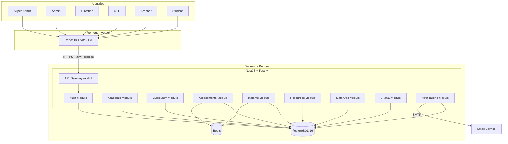
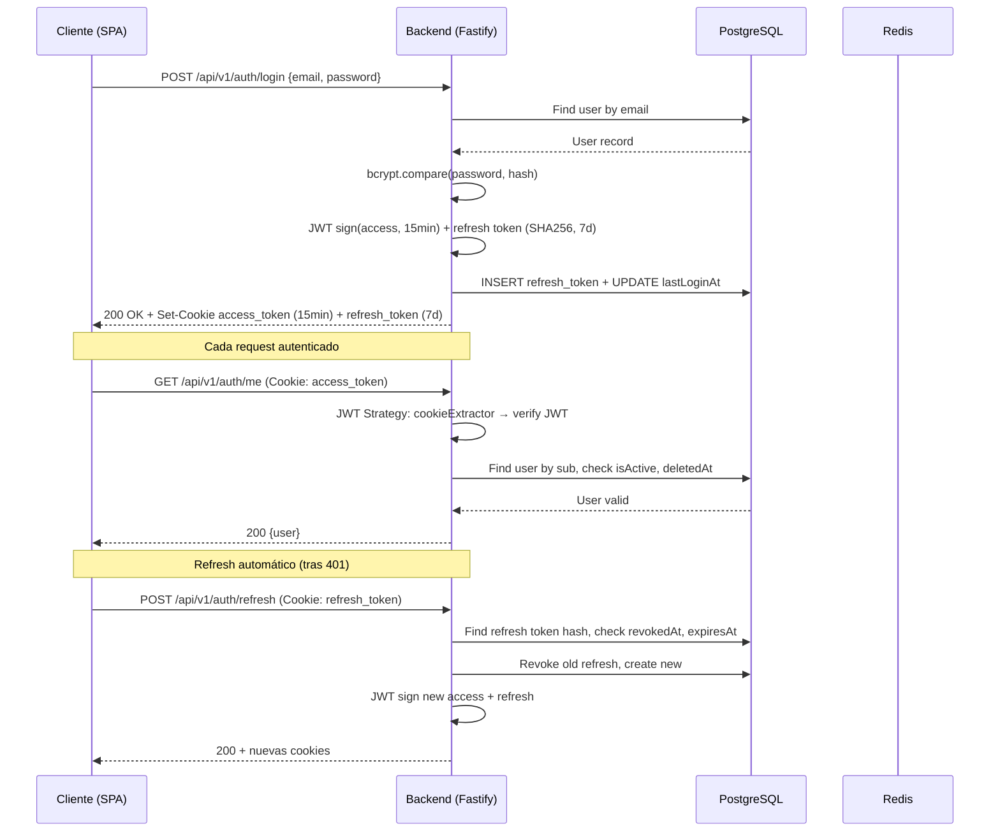
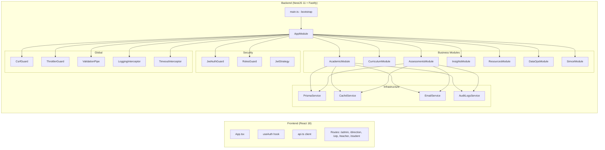

# AUDITORÍA INTEGRAL DE SISTEMA — CORDILLERA SAAS PRO v3.0

**Fecha:** 2026-06-23  
**Repositorio:** cordillera_puerto- (monorepo npm workspaces)  
**Rama:** `coolify-deploy-test`  
**Commit:** `3bce88f` — Mejoras visuales del modal de envío y corrección de títulos Asignatura/Nivel  
**Equipo auditor:** Comité multidisciplinario (Arquitectura, Backend, Frontend, Datos, Seguridad, QA, DevOps, Funcional)

---

## RESUMEN EJECUTIVO

CORDILLERA SAAS PRO v3.0 es una plataforma de monitoreo de aprendizajes para el sistema educativo chileno (Escuela Mario Muñoz Silva, SLEP Puerto Cordillera, ~215 estudiantes, 1° a 8° básico). Se trata de un monorepo con 3 workspaces (backend NestJS 11 + Fastify, frontend React 18 + Vite, shared types) que implementa 17 módulos NestJS, 42+ controladores con ~171 endpoints REST, 35+ modelos PostgreSQL vía Prisma ORM, y ~28 páginas frontend con 7 roles de usuario.

**Estado general:** Funcionalmente avanzado con cobertura amplia del dominio educativo. La arquitectura de autorización por scope es robusta. Existen discrepancias entre documentación y código real, particularmente en cobertura de tests y la completitud de ciertos módulos. El sistema está operativo en Render (backend) + Vercel (frontend) con Docker Compose para desarrollo local.

**Porcentaje de avance estimado:** 72% ± 8% (ver sección Medición del Avance).

---

## ALCANCE Y LIMITACIONES

### Alcance
- Auditoría completa de código fuente (backend 197 archivos, frontend ~120 archivos, shared 2 archivos)
- Revisión de todos los archivos de configuración, Docker, esquema de BD, migraciones, seeds
- Análisis de autenticación, autorización, seguridad y modelo de datos
- Verificación de trazabilidad frontend↔backend↔datos
- Documentación incluida (README, Fichas Funcionales, Oferta Técnica, Manual Usuario)

### Limitaciones
- No se ejecutó el sistema en runtime (análisis estático)
- No se verificó conectividad real con base de datos, Redis o SMTP
- No se realizaron pruebas de penetración activas
- Los archivos `.env` reales no fueron leídos (solo `.env.example`)
- La migración actual de Prisma no se ejecutó para verificar integridad contra BD real
- No se auditaron assets binarios (PDF, imágenes, ZIP)
- Algunas páginas frontend no fueron leídas en detalle por restricciones de tiempo

---

## FASE 0: LÍNEA BASE

| Métrica | Valor |
|---|---|
| Fecha auditoría | 2026-06-23 |
| Rama | `coolify-deploy-test` |
| Commit HEAD | `3bce88f77fa37169e49d41203e01a6a49ed2ffbb` |
| Total commits | 91 |
| Workspaces | backend, frontend, shared |
| Archivos backend (src) | 197 |
| Archivos frontend (src) | ~120 |
| Archivos test backend | 8 (.spec.ts) + 1 (e2e) |
| Archivos test frontend | 9 (.test.*) |
| Migraciones Prisma | 12 |
| Módulos seed | 13 |
| Archivos ignorados relevantes | .env, uploads/, dist/, backups/ |
| Archivos no rastreados | Excels, PDFs, ZIPs de trabajo (no son parte del proyecto) |

---

## FASE 1: INVENTARIO TECNOLÓGICO

### Stack verificado

| Capa | Tecnología | Versión | Evidencia |
|---|---|---|---|
| Backend runtime | Node.js | 22 (Dockerfile) | `backend/Dockerfile:1` |
| Framework HTTP | NestJS 11 + Fastify | ^11.x | `backend/package.json` |
| ORM | Prisma | ^6.x | `backend/package.json`, `schema.prisma` |
| Base de datos | PostgreSQL | 16 (Docker) | `docker-compose.yml:8` |
| Frontend UI | React | ^18.3.1 | `frontend/package.json` |
| Build tool | Vite | ^5.4.11 | `frontend/package.json`, `vite.config.js` |
| Routing | react-router-dom | ^6.28.0 | `frontend/package.json` |
| Server state | @tanstack/react-query | ^5.62.10 | `frontend/package.json` |
| Charts | recharts | ^2.15.0 | `frontend/package.json` |
| PDF rendering | pdfjs-dist | ^5.6.205 | `frontend/package.json` |
| PDF generation | jsPDF + autotable | ^4.2.1 / ^5.0.8 | `frontend/package.json` |
| Excel I/O | exceljs | (backend) | `backend/package.json` |
| Auth | passport-jwt + @nestjs/jwt | — | `backend/src/modules/auth/` |
| Passwords | bcryptjs | — | `backend/src/modules/auth/auth.service.ts:10` |
| Validation | class-validator + zod | — | `backend/src/config/env.schema.ts` |
| Cache | ioredis (Redis) con fallback | — | `backend/src/modules/cache/` |
| Email | nodemailer | — | `backend/src/modules/notifications/email.service.ts` |
| Rate limiting | @nestjs/throttler | — | `backend/src/app.module.ts:26-32` |
| CSRF | @fastify/csrf-protection + guard propio | — | `backend/src/common/guards/csrf.guard.ts` |
| Security headers | @fastify/helmet | — | `backend/src/main.ts:38-54` |
| PWA | Service Worker | — | `frontend/public/sw.js`, `manifest.json` |
| Voice input | Web Speech API | — | `frontend/src/components/voice/` |
| OMR | Canvas-based | — | `frontend/src/lib/omr.ts` |
| Sanitization | dompurify (frontend), stripHtml (backend) | ^3.4.4 | `frontend/src/lib/sanitize.ts`, `backend/src/common/utils/sanitize.ts` |

### Dependencias de infraestructura

| Componente | Imagen/Proveedor | Puerto | Propósito |
|---|---|---|---|
| PostgreSQL | postgres:16-alpine | 5433→5432 | Base de datos principal |
| Redis | redis:7-alpine | 6379 | Caché (opcional, fallback in-memory) |
| Backend | Dockerfile (node:22-alpine) | 4000 | API REST |
| pgAdmin | dpage/pgadmin4:8 | 5050 | Admin BD (solo dev) |
| Nginx | nginx:alpine | 80 | Reverse proxy + estáticos |
| Backup | postgres:16-alpine | — | Cron pg_dump diario |
| Deploy backend | Render (BluePrint) | — | `render.yaml` |
| Deploy frontend | Vercel | — | `vercel.json` |

### Discrepancias de inventario

| ID | Severidad | Descripción | Evidencia |
|---|---|---|---|
| INV-001 | Medio | README reporta 168 tests backend + 120 frontend = 288. Conteo real: ~171 backend + ~113 frontend = ~284. Diferencia menor pero la cifra documentada es imprecisa. | `README.md`, conteo real en `backend/src/**/*.spec.ts` y `frontend/src/**/*.test.*` |
| INV-002 | Medio | No existe `.github/workflows/` — sin CI/CD configurado en el repositorio. | Búsqueda glob sin resultados |
| INV-003 | Bajo | `backend/src/shared/features.ts` solo define `parent_portal` (1 flag), mientras `shared/src/features.ts` define 7 flags. El backend no consume el paquete compartido para feature flags. | `backend/src/shared/features.ts:1`, `shared/src/features.ts` |
| INV-004 | Bajo | `frontend/package.json` declara `dompurify` y `pdfjs-dist` como dependencias. En Vite se construyen en el bundle del cliente. `pdfjs-dist` es pesado (~3 MB) y podría cargarse dinámicamente. | `frontend/package.json` |
| INV-005 | Bajo | No hay `.dockerignore` en frontend ni backend. El contexto de build Docker puede incluir archivos innecesarios. | Ausencia de archivo |
| INV-006 | Mejora | `ARQUITECTURA_V4.md` describe una arquitectura anterior con Express + 8 endpoints. No refleja el sistema actual (NestJS + 171 endpoints). Debe marcarse como obsoleto. | `ARQUITECTURA_V4.md:1-72` |

---

## FASE 2: ARQUITECTURA

### Estilo arquitectónico

El sistema sigue una **arquitectura modular por capas** dentro de NestJS, con 17 módulos de dominio agrupados en 8 dominios funcionales. No es estrictamente hexagonal (no hay puertos/adaptadores explícitos), pero mantiene separación de responsabilidades:

```
Presentación (Controllers) → Servicio (Services) → Persistencia (Prisma ORM)
                                                      ↕
                                                PostgreSQL + Redis
```

### Diagrama de contexto (Mermaid)



### Diagrama de autenticación



### Diagrama de componentes principales



### Evaluación de acoplamiento

| Aspecto | Evaluación | Evidencia |
|---|---|---|
| Dependencias circulares | No detectadas | Módulos importan de forma jerárquica |
| Responsabilidad única | Bien: controladores delegan a servicios, servicios a Prisma | Patrón consistente en todos los módulos |
| Prisma como dependencia | Alto acoplamiento: todos los servicios inyectan PrismaService directamente. No hay repositorios abstractos. | `backend/src/modules/*/**.service.ts` |
| Módulo Auth como dependencia | Solo AuditLogsService recibe dependencia explícita de AuthService para logging | `backend/src/modules/auth/auth.service.ts:27` |
| Puntos únicos de fallo | PostgreSQL es SPOF. Redis tiene fallback in-memory. | `docker-compose.yml`, `cache.service.ts` |
| Shared package | Bien usado para tipos entre frontend/backend. Poco usado (solo tipos y feature flags). | `shared/src/index.ts` |

---

## FASE 3: TRAZABILIDAD FUNCIONAL VERTICAL

### Módulo: Autenticación

| Capa | Componente | Estado | Evidencia |
|---|---|---|---|
| Interfaz | `LoginPage.tsx`, `ForgotPasswordPage.tsx`, `ResetPasswordPage.tsx`, `ChangePasswordPage.tsx` | Funcional verificado | `frontend/src/features/auth/` |
| Estado | `useAuth()` hook — estado local + localStorage + refresh automático cada 10 min | Funcional verificado | `frontend/src/hooks/useAuth.ts:40-46` |
| Cliente API | `api.login()`, `api.refresh()`, `api.me()`, `api.logout()`, `api.changePassword()`, `api.forgotPassword()`, `api.resetPassword()` | Funcional verificado | `frontend/src/lib/api.ts` |
| Endpoint | `POST /api/v1/auth/login` (público), `GET /api/v1/auth/me`, `POST /api/v1/auth/refresh`, `POST /api/v1/auth/logout`, `PATCH /api/v1/auth/me`, `POST /api/v1/auth/change-password`, `POST /api/v1/auth/forgot-password`, `POST /api/v1/auth/reset-password` | Funcional verificado | `backend/src/modules/auth/auth.controller.ts` |
| Autorización | Login/refresh/forgot/reset: `@Public()`. Me/change/logout: `@UseGuards(JwtAuthGuard)` | Correcto | `auth.controller.ts:28,48,70,81,98,117,131,140` |
| Validación | LoginDto (email + minLength 8 contraseña), ChangePasswordDto (minLength 10), password policy (10+ chars, 4 categorías) | Correcto | `backend/src/modules/auth/dto/login.dto.ts` |
| Servicio | AuthService: bcrypt compare, JWT sign, refresh token rotation (SHA256 hash), rate-limit por endpoint | Funcional verificado | `backend/src/modules/auth/auth.service.ts` |
| Modelo | User (email único, passwordHash, role, isActive, mustChangePassword, deletedAt), RefreshToken (tokenHash único, expiresAt, revokedAt) | Funcional verificado | `schema.prisma:293-343` |
| Persistencia | Prisma — transacciones implícitas (update + create en refresh) | Correcto | `auth.service.ts:107-123` |
| Respuesta | 200 con token + refreshToken + user payload. Cookies httpOnly con SameSite dinámico. | Correcto | `auth.controller.ts:149-167` |
| Actualización visual | Redirección a ruta por rol, mustChangePassword interceptor, `RequireRole` wrapper | Funcional verificado | `frontend/src/App.tsx:57-70,177-193` |

### Módulo: Gestión de Cursos

| Capa | Componente | Estado | Evidencia |
|---|---|---|---|
| Interfaz | `CoursesView.tsx` + `AdminLayout.tsx` (sidebar "Cursos y Asignaturas") | Funcional verificado | `frontend/src/features/admin/CoursesView.tsx` |
| Endpoint | `GET/POST /api/v1/courses`, `GET/PATCH/DELETE /api/v1/courses/:id`, `GET /api/v1/courses/:id/students` | Funcional verificado | `backend/src/modules/academic/courses/courses.controller.ts` |
| Autorización | Roles: ADMIN/SUPER_ADMIN/DIRECTION/UTP para CRUD; TEACHER solo GET; SUPER_ADMIN para DELETE | Verificado en backend | `courses.controller.ts:20,27,49,56,64,71` |
| Servicio | CoursesService con scope de institución y año académico | Verificado | `backend/src/modules/academic/courses/courses.service.ts` |
| Modelo | Course (name, gradeLevel, section, maxStudents) vinculado a Institution + AcademicYear | Correcto | `schema.prisma:421-449` |

### Módulo: Evaluaciones (Assessments)

| Capa | Componente | Estado | Evidencia |
|---|---|---|---|
| Interfaz | `AssessmentsPage.tsx`, `AssessmentDetailPage.tsx`, `AssessmentTemplatesPage.tsx`, `CorreccionPruebasPage.tsx`, `FastCorrectionPage.tsx`, `EvaluationsPage.tsx`, `GradebookPage.tsx`, `LibroEvaluacionesPage.tsx` | Implementado parcialmente | 8 páginas frontend, estados de carga/error verificados en algunas |
| Endpoint | CRUD assessments, GET/POST questions, POST attempt/submit, GET grading, PATCH grade, POST change-request | Funcional verificado | ~20 endpoints en módulo assessments |
| Autorización | Roles por endpoint. TEACHER solo sus cursos asignados. STUDENT solo evaluaciones de su curso. | Correcto con scope | `access-scope.ts:182-228` |
| Servicio | AssessmentsService, AttemptsService, GradingService, ImportTestService, DocumentAssessmentParserService | Funcional verificado | 5 servicios |
| Modelo | Assessment, AssessmentQuestion, AssessmentAttempt, StudentAnswer, Grade, GradeChangeRequest, ImportedTestDraft, AssessmentTemplate | Completo | `schema.prisma:660-927` |
| Máquina de estados | Assessment: DRAFT→PUBLISHED→ACTIVE→CLOSED→IN_GRADING→GRADED→REPORTED→ARCHIVED | Implementado como string "status" | `schema.prisma:716` — no es un enum, es String |
| Ponderaciones | weight en Assessment (permite ponderación), Period tiene weight | Implementado parcialmente | `schema.prisma:719,273` |

### Módulo: SIMCE

| Capa | Componente | Estado | Evidencia |
|---|---|---|---|
| Interfaz | `SimceBankPage.tsx` + 8 subcomponentes (lista, creación, corrección, resultados, visor PDF) | Funcional verificado | `frontend/src/pages/admin/simce/` |
| Endpoint | ~20 endpoints CRUD SIMCE, subida PDF, claves de respuesta, corrección, resultados | Funcional verificado | `backend/src/modules/simce/simce.controller.ts` |
| Feature flag | `simce_bank` (habilitado por defecto) | Correcto | `shared/src/features.ts` |
| Modelo | SimceAssessment, SimceAnswerKey, SimceStudentResponse | Completo | `schema.prisma:1320-1401` |

### Módulo: Importación Masiva

| Capa | Componente | Estado | Evidencia |
|---|---|---|---|
| Interfaz | `ImportPage.tsx`, `StudentBulkImportPanel.tsx`, `TeacherBulkImportPanel.tsx` | Funcional verificado | `frontend/src/features/admin/` |
| Endpoint | `POST /api/v1/imports/upload/students`, `POST /api/v1/imports/upload/teachers`, GET jobs | Funcional verificado | `backend/src/modules/data-ops/imports/imports.controller.ts` |
| Autorización | ADMIN/SUPER_ADMIN/DIRECTION/UTP | Correcto | `imports.controller.ts:22` |
| Servicio | ImportsService: validación Excel, creación de cursos, manejo de letras A/B, contraseñas temporales, scope institucional | Funcional verificado | `backend/src/modules/data-ops/imports/imports.service.ts` (1132 líneas) |
| Reglas de negocio | Conserva 1° básico sin letra; crea/reutiliza curso sin sección; respeta letra cuando informada; usa colegio y año activo | Verificado | `imports.service.ts:633` |

### Módulo: Rutas Remediales

| Capa | Componente | Estado | Evidencia |
|---|---|---|---|
| Interfaz | `RemedialRoutesPage.tsx` | Implementado parcialmente | Feature-flagged: `remedial_routes` |
| Endpoint | CRUD RemedialPlan, GET/POST/PATCH | Funcional verificado | `backend/src/modules/insights/remedial-plans/` |
| Servicio | RemedialPlansService con estados PENDING→IN_PROGRESS→COMPLETED→EFFECTIVE/NOT_EFFECTIVE | Funcional verificado | + spec con 32 tests |
| Modelo | RemedialPlan vinculado a Student, Course, Subject, LearningObjective | Completo | `schema.prisma:931-955` |

### Módulo: Panel de Alumno

| Capa | Componente | Estado | Evidencia |
|---|---|---|---|
| Interfaz | `AlumnoDashboard.tsx` + `StudentAssessmentAttemptPage.tsx` | Funcional verificado | `frontend/src/features/alumno/`, `frontend/src/pages/alumno/` |
| Endpoint | GET attempts, POST/PATCH submit answers, GET results | Funcional verificado | `backend/src/modules/assessments/attempts/` |
| Autorización | Estudiante solo ve sus intentos en evaluaciones de cursos donde está matriculado | Correcto con scope | `access-scope.ts:218-224` |
| Modal de envío | Corregido: estilo azul, muestra preguntas respondidas/pendientes, advierte faltantes | Funcional verificado | Commit `3bce88f` |

### Módulo: Reportes

| Capa | Componente | Estado | Evidencia |
|---|---|---|---|
| Interfaz | `ReportsPage.tsx` | Implementado parcialmente | `frontend/src/pages/admin/ReportsPage.tsx` |
| Endpoint | GET /api/v1/reports con filtros, POST generate | Funcional verificado | `backend/src/modules/insights/reports/` |
| Modelo | Report con status PENDING→GENERATING→GENERATED→SENT/OUTDATED/ERROR, type, filters JSON | Completo | `schema.prisma:959-982` |
| PDF | Cliente: jsPDF + autotable. Servidor: no usa Puppeteer. | Limitación: PDFs pesados en cliente | `frontend/src/lib/simce-export.ts` |

### Módulos sin frontend (solo backend) o sin backend (solo interfaz)

| Módulo | Estado | Evidencia |
|---|---|---|
| Attendance (Asistencia) | Solo backend: controlador + servicio + modelo. Sin página frontend visible en rutas. | `backend/src/modules/academic/attendance/`, sin ruta en `routes.tsx` |
| Observations (Observaciones) | Solo backend. Sin página frontend. | `backend/src/modules/academic/observations/` |
| Class Book (Libro de Clases) | Solo backend. Sin página frontend directa (LibroEvaluacionesPage es distinto). | `backend/src/modules/academic/class-book/` |
| Lessons (Clases/Sesiones) | Solo backend. Sin página frontend visible. | `backend/src/modules/resources/lessons/` |
| Parent Portal | Feature flag `parent_portal=false`. Sin frontend ni backend específico. | `shared/src/features.ts:6` |
| Audit Logs | Backend + frontend (`AuditLogsPage.tsx`). Funcional. | Verificado |
| Notifications | Backend completo + página `BandejaPage.tsx` para bandeja UTP. | Verificado |

---

## FASE 4: BACKEND Y REGLAS DE NEGOCIO

### Catálogo de reglas de negocio verificadas

| ID | Regla | Ubicación | Roles afectados | Estado |
|---|---|---|---|---|
| AUTH-01 | Email único + lowercased + trimmed en login | `auth.service.ts:33` | Todos | Funcional |
| AUTH-02 | Solo usuarios isActive=true pueden autenticarse | `auth.service.ts:40-42` | Todos | Funcional |
| AUTH-03 | Refresh token: hash SHA256, expira 7d, revocación al usar | `auth.service.ts:89-111,273-291` | Todos | Funcional |
| AUTH-04 | Cambio de contraseña: revoca todos los refresh tokens del usuario | `auth.service.ts:166-169` | Todos | Funcional |
| AUTH-05 | Password policy: >=10 chars, 1 mayúscula, 1 minúscula, 1 número, 1 símbolo | `password-policy.ts:3-19` | Todos | Funcional |
| AUTH-06 | Reset password: token JWT con purpose="password-reset", expira 15min | `auth.service.ts:316-319` | Todos | Funcional |
| ACA-01 | Curso único por año académico + nombre | `schema.prisma:446` | Admin/UTP/Dir | Funcional |
| ACA-02 | Período único por año académico + nombre | `schema.prisma:286` | Admin/UTP/Dir | Funcional |
| ACA-03 | Enrollment único por estudiante + curso | `schema.prisma:461` | Admin/UTP/Dir | Funcional |
| ACA-04 | TeacherCourseAssignment único por profesor + curso + asignatura | `schema.prisma:476` | Admin/UTP/Dir | Funcional |
| ASM-01 | Assessment intento único por evaluación + estudiante | `schema.prisma:848` | Student/Teacher | Funcional |
| ASM-02 | StudentAnswer único por intento + pregunta | `schema.prisma:869` | Student | Funcional |
| ASM-03 | Grade único por evaluación + estudiante | `schema.prisma:893` | Teacher/Admin | Funcional |
| ASM-04 | Nota chilena: 1.0 a 7.0, aprobación >=4.0, exigencia configurable (default 60%) | `institution_config` | Teacher | Configurable |
| IMP-01 | Importación alumnos: conserva 1° sin letra, respeta letra, crea curso sin sección si no existe | `imports.service.ts:633` | Admin/UTP | Funcional |
| IMP-02 | Contraseña temporal para importados: Temp2026** | `imports.service.ts:45-46` | Admin/UTP | Funcional |
| IMP-03 | Scope institucional para importación: solo SUPER_ADMIN/ADMIN pueden importar en otra institución | `imports.service.ts:76-77` | Admin | Funcional |
| CUR-01 | LearningObjective.code único global | `schema.prisma:572` | Admin/UTP | Funcional |
| CUR-02 | Asignatura.name único global | `schema.prisma:484` | Admin | Funcional |
| CUR-03 | CurriculumRule por subject+gradeLevel único | `schema.prisma:513` | Admin/UTP | Funcional |
| GRD-01 | GradeChangeRequest requiere aprobación (PENDING→APPROVED/REJECTED) | `schema.prisma:900-904` | Teacher/UTP | Funcional |
| SEC-01 | SUPER_ADMIN: sin restricción de institución (isGlobalAdmin) | `access-scope.ts:57-58` | SuperAdmin | Funcional |
| SEC-02 | ADMIN sin institutionId = global admin | `access-scope.ts:58` | Admin | Funcional |
| SEC-03 | Teacher solo accede a cursos/asignaturas asignados | `access-scope.ts:113-118` | Teacher | Funcional |
| SEC-04 | Student solo accede a cursos donde está matriculado | `access-scope.ts:121-128` | Student | Funcional |
| SEC-05 | Staff (ADMIN/DIRECTION/UTP) limitado a su institución | `access-scope.ts:106-111` | Admin/Dir/UTP | Funcional |
| DOP-01 | Formatos de archivo aceptados: .xlsx, .xls, .csv | `imports.service.ts:85-87` | Admin/UTP | Funcional |
| DOP-02 | Límite de subida: 50 MB | `main.ts:25` | Todos | Funcional |

### Validaciones y DTOs

- `ValidationPipe` global con `whitelist: true, forbidNonWhitelisted: true, transform: true` en `main.ts:103-108`
- Todos los DTOs usan class-validator para validación de entrada
- `Zod` para validación de variables de entorno en `config/env.schema.ts`
- No se detecta sanitización automática de strings en DTOs (class-validator no sanitiza, solo valida). El sanitizer manual existe en `common/utils/sanitize.ts` pero debe ser invocado explícitamente.

### Manejo de errores

- `HttpExceptionFilter` global captura excepciones HTTP estándar
- `PrismaExceptionFilter` global captura errores de Prisma (unicidad, FK, etc.)
- Errores no manejados: `unhandledRejection` y `uncaughtException` logged en `main.ts:167-174`
- Transacciones: no se detecta uso explícito de `prisma.$transaction` en servicios clave. Las operaciones compuestas (ej: refresh token: revocar + crear) se ejecutan secuencialmente sin transacción.

### Registro de auditoría

- `AuditLogsService` integrado en AuthService (login, logout, password change, profile update, forgot/reset)
- Modelo AuditLog con actor, acción, entidad, oldValue/newValue, IP, userAgent
- No se verifica que todos los servicios del sistema registren auditoría (solo Auth está confirmado)

---

## FASE 5: FRONTEND Y EXPERIENCIA

### Arquitectura de rutas

El sistema implementa **3 vistas de administración separadas** por rol (admin, direction, utp) que comparten el mismo `AdminLayout` con diferentes `mode`. Esto evita duplicación de código pero:

- **Problema potencial:** Las rutas se filtran en frontend por `mode` (ej: `exportar` solo admin, `usuarios` admin+utp), pero el backend también tiene `@Roles()`. Si el filtro frontend falla, el backend rechazará. Esto es defensa en profundidad correcta.

### Vistas por rol

| Rol | Vistas | Layout |
|---|---|---|
| SUPER_ADMIN | /admin/* (30+ páginas) | AdminLayout mode="admin" |
| ADMIN | /admin/* (mismas rutas que SUPER_ADMIN) | AdminLayout mode="admin" |
| DIRECTION | /direction/* (subconjunto: sin usuarios, exportar, profesores admin) | AdminLayout mode="direction" |
| UTP | /utp/* (subconjunto: con importar, sin exportar, sin profesores admin) | AdminLayout mode="utp" |
| TEACHER | /teacher/* (dashboard + importar prueba + detalle evaluación) | ProfesorDashboard |
| STUDENT | /student/* (dashboard + evaluación online) | AlumnoDashboard |

### Evaluación de UX

| Aspecto | Evaluación | Evidencia |
|---|---|---|
| Estados de carga | `LoadingSpinner` + `Skeleton` en la mayoría de páginas. `SuspenseWrapper` en rutas lazy. | `frontend/src/components/common/LoadingSpinner.tsx`, `Skeleton.tsx` |
| Estados de error | `ErrorBoundary` global + por página. Mensaje de error en LoginPage. | `frontend/src/components/common/ErrorBoundary.tsx` |
| Estados vacíos | `EmptyState` componente disponible. No se verificó uso consistente en todas las páginas. | `frontend/src/components/common/EmptyState.tsx` |
| Responsive | Sidebar colapsable. CSS con media queries. Modal adaptable a celulares. | `frontend/src/components/layout/Sidebar.tsx`, `global.css` |
| Accesibilidad | No se detectan atributos ARIA, roles semánticos, ni navegación por teclado. Sin focus management. | Búsqueda en componentes |
| Protección anti doble envío | `loginRef` en useAuth previene doble login. No se verificó en formularios de creación/edición. | `frontend/src/hooks/useAuth.ts:71-73` |
| Pérdida de estado | Datos de formulario no se persisten en sessionStorage. Navegación hacia atrás puede perder estado. | No verificado |
| Feature flags | 3 rutas condicionales: simce (simce_bank), remedial (remedial_routes), monitoreo+correccion (online_assessments) | `frontend/src/app/routes.tsx:178,183,186` |

### Componentes clave verificados

| Componente | Estado | Ubicación |
|---|---|---|
| Modal | Corregido recientemente con estilo azul, responsive | `frontend/src/components/common/Modal.tsx` |
| DataTable | Tabla reutilizable con sorting y paginación | `frontend/src/components/common/DataTable.tsx` |
| Sidebar | Colapsable, categorizado, con badges de feature flags | `frontend/src/components/layout/Sidebar.tsx` |
| ShellLayout | Header + breadcrumbs + actions | `frontend/src/components/common/ShellLayout.tsx` |
| KpiCard | Tarjetas de indicadores | `frontend/src/components/common/KpiCard.tsx` |
| Toast | Sistema de notificaciones toast | `frontend/src/components/common/Toast.tsx` |
| OMRReader | Lector de hoja de respuestas por cámara | `frontend/src/components/omr/OMRReader.tsx` |
| VoiceInput | Entrada por voz (Web Speech API) | `frontend/src/components/voice/VoiceInputButton.tsx` |
| StudentBulkImportPanel | Panel de importación masiva de alumnos con Excel | `frontend/src/features/admin/StudentBulkImportPanel.tsx` |

### Interfaz sin backend / Backend sin interfaz

| Situación | Elementos |
|---|---|
| **Backend sin frontend** | Attendance, Observations, ClassBook, Lessons, Permissions (asignación granular), InstitutionConfig, FeatureFlags (gestión), Cache (monitoreo), Notifications (gestión admin) |
| **Frontend sin backend** | Ninguno detectado — todas las páginas frontend llaman endpoints reales vía `api.ts`. Los datos mock en `data/` son para desarrollo. |

---

## FASE 6: DATOS Y MODELOS

### Modelo Entidad-Relación (resumido)

**Entidades principales (35+ tablas):**

```
Institution ──< AcademicYear ──< Period
     │               │
     │               ├──< Course ──< Enrollment >── Student ── User
     │               │      │
     │               │      ├──< TeacherCourseAssignment >── Teacher ── User
     │               │      ├──< Assessment ──< AssessmentQuestion >── Question
     │               │      │       │                    │
     │               │      │       ├──< AssessmentAttempt >── StudentAnswer
     │               │      │       ├──< Grade >── GradeChangeRequest
     │               │      │       └──< LearningResource
     │               │      ├──< Lesson ──< LessonResource
     │               │      ├──< Attendance
     │               │      ├──< Observation
     │               │      └──< ClassBookEntry
     │               │
     │               ├──< Subject ──< Axis ──< LearningObjective ──< LearningObjectiveSkill >── Skill
     │               │      │            │
     │               │      ├──< CurriculumUnit
     │               │      └──< CurriculumRule
     │               │
     │               ├──< SimceAssessment ──< SimceAnswerKey
     │               │       └──< SimceStudentResponse
     │               │
     │               └──< Report, ImportJob, ExportJob, AuditLog, Notification, FileAsset
     │
     └──< InstitutionConfig
     
User ──< RefreshToken, UserPermission >── Permission
```

### Cardinalidades verificadas

| Relación | Tipo | Verificación |
|---|---|---|
| Institution 1─N AcademicYear | Cascade delete | `schema.prisma:256` |
| AcademicYear 1─N Course | Sin cascade explícito (Prisma default: Restrict) | `schema.prisma:434` |
| Course 1─N Enrollment | Cascade delete | `schema.prisma:459` |
| Student 1─N Enrollment | Cascade delete | `schema.prisma:458` |
| Course 1─N Assessment | Sin cascade (Restrict) | `schema.prisma:741` |
| Assessment 1─N AssessmentAttempt | Sin cascade (Restrict) | `schema.prisma:843` |
| AssessmentAttempt 1─N StudentAnswer | Cascade delete | `schema.prisma:866` |
| Assessment 1─N Grade | Cascade delete | `schema.prisma:887` |
| User 1─1 Teacher | Cascade delete | `schema.prisma:381` |
| User 1─0..1 Student | SetNull al borrar user | `schema.prisma:406` |

### Índices verificados

- Claves foráneas con índices implícitos (Prisma los crea automáticamente)
- Índices explícitos en: `institutions.isActive`, `academic_years(institutionId, isActive)`, `users(email, isActive)`, `users(institutionId, role)`, `courses(institutionId, gradeLevel)`, `enrollments(courseId, isActive)`, `students(lastName, firstName)`, `assessments(courseId, subjectId, assessmentType)`, `assessments(status)`, `assessments(isActive, startDate, endDate)`, `questions(subjectId, type, isActive)`, `audit_logs(actorId)`, `audit_logs(entityType, entityId)`, `audit_logs(createdAt)`, `notifications(userId, status)`, etc.
- **Hallazgo:** No hay índice en `grades.studentId` para consultas de historial de notas (aunque FK implícito existe).
- **Hallazgo:** No hay índice en `assessment_attempts.studentId` + `status` para dashboard de alumno.

### Enums y constantes

9 enums definidos en Prisma:
- `UserRole`: SUPER_ADMIN, ADMIN, DIRECTION, UTP, TEACHER, STUDENT, PARENT
- `AssessmentType`: DIAGNOSTICA, PROCESO, CIERRE, PARCIAL, FINAL, SIMCE
- `QuestionType`: MULTIPLE_CHOICE, TRUE_FALSE, SHORT_ANSWER, ESSAY, MATCHING
- `AssessmentMode`: ONLINE, PRINTED, MIXED
- `AttemptStatus`: IN_PROGRESS, COMPLETED, TIMED_OUT, CLOSED, CANCELLED
- `AnswerStatus`: PENDING, CORRECT, INCORRECT, PARTIAL, OMITTED, MANUAL_REVIEW
- `RemedialStatus`: PENDING, IN_PROGRESS, COMPLETED, EVALUATED, EFFECTIVE, NOT_EFFECTIVE
- `ImportStatus`: PENDING, VALIDATING, READY, IMPORTING, COMPLETED, PARTIAL, FAILED
- Otros: ResourceType, ResourceStatus, AssessmentDeliveryMode, LessonStatus, GuideType, PermissionAction (42 acciones), AttendanceStatus, ObservationType, NotificationChannel, NotificationStatus, GradeChangeStatus, SimceStatus

### Soft delete

Modelos con `deletedAt`: Institution, User, Student.  
Modelos sin soft delete (borrado físico): Course, Assessment, Enrollment, Grade, etc.

### Migraciones

12 migraciones aplicadas, desde `20260516191251_init` hasta `20260615123000_add_teacher_assessment_validation`. Sin migraciones pendientes. Las migraciones cubren:
1. Schema inicial completo
2. Permisos y config de institución
3. Solicitudes de cambio de nota
4. Permiso STUDENTS_READ
5. Asistencia, observaciones, libro de clases
6-7. Modelos SIMCE
8. Resource usage logs
9. Imported test drafts
10-12. Digital assessment source files, templates, validación docente

### Riesgos de integridad de datos

| ID | Riesgo | Severidad | Evidencia |
|---|---|---|---|
| DAT-001 | **Medio** | Grade no tiene restricción de rango a nivel de BD (solo Float). Podrían insertarse notas fuera de 1.0-7.0 si el backend no valida. | `schema.prisma:879` |
| DAT-002 | **Medio** | Assessment.status es String, no Enum. Valores inválidos posibles si no se validan en servicio. | `schema.prisma:716` |
| DAT-003 | **Bajo** | RefreshToken no tiene limpieza automática de tokens expirados/revocados. Puede crecer indefinidamente. | `schema.prisma:331-343` |
| DAT-004 | **Bajo** | StudentAnswer.selectedOptionId no verifica que la opción pertenezca a la pregunta. Sin FK constraint explícita a QuestionOption. | `schema.prisma:858` (solo referencia Question, no QuestionOption) |
| DAT-005 | **Mejora** | Varios campos usan `String` para estados que tienen enums definidos (ej: Period.status, Report.status, ExportJob.status). Deberían usar los enums nativos de Prisma. | `schema.prisma` |

---

## FASE 7: ROLES, AUTORIZACIÓN Y MULTIINSTITUCIÓN

### Matriz de roles × acceso

| Rol | Instituciones | Usuarios | Cursos | Alumnos | Profesores | Evaluaciones | Notas | Reportes | SIMCE | Import/Export | Auditoría |
|---|---|---|---|---|---|---|---|---|---|---|---|
| **SUPER_ADMIN** | Ilimitado | Todos | Todos | Todos | Todos | Todas | Todas | Todos | Todos | Sí | Sí |
| **ADMIN** | Su institución (o global si sin inst) | Su inst. | Su inst. | Su inst. | Su inst. | Su inst. | Su inst. | Su inst. | Su inst. | Sí | Sí |
| **DIRECTION** | Su institución | Solo lectura | Su inst. | Su inst. | Su inst. | Su inst. | Su inst. | Su inst. | Su inst. | No | Sí |
| **UTP** | Su institución | Gestión (sin asignar roles) | Su inst. | Su inst. | Su inst. | Su inst. | Su inst. | Su inst. | Su inst. | Solo import | Sí |
| **TEACHER** | N/A | N/A | Solo asignados | Alumnos de sus cursos | Solo self | Solo sus evaluaciones | Solo sus evaluaciones | Limitado | Solo sus ensayos | No | No |
| **STUDENT** | N/A | N/A | Solo su curso | Solo self | N/A | Solo evaluaciones de su curso | Solo sus notas | N/A | Solo sus resultados | No | No |
| **PARENT** | N/A | N/A | N/A | N/A | N/A | N/A | N/A | N/A | N/A | No | No |

### Verificación de control de acceso horizontal

| Prueba conceptual | ¿Mitigado? | Mecanismo |
|---|---|---|
| Cambiar ID de institución en request | Sí | `assertInstitutionScope()` verifica institutionId del usuario |
| Acceder a curso de otra institución | Sí | `assertCourseScope()` verifica institutionId del curso |
| Teacher accediendo a curso no asignado | Sí | `assertCourseScope()` verifica `courseAssignments` |
| Student accediendo a evaluación de otro curso | Sí | `assertAssessmentScope()` verifica enrollment |
| Student viendo notas de otro alumno | Sí | `assertStudentScope()` verifica studentId propio |
| Admin de institución A viendo datos de B | Sí | `assertInstitutionScope()` filtra por institutionId |
| UTP intentando eliminar institución | Sí | `@Roles("SUPER_ADMIN")` en endpoint de delete |
| PARENT sin acceso | Sí | Rol PARENT no tiene rutas frontend ni endpoints accesibles |

### Control de acceso vertical (escalamiento de privilegios)

| Prueba conceptual | ¿Mitigado? | Mecanismo |
|---|---|---|
| Teacher llamando endpoint de creación de usuarios | Sí | `@Roles("ADMIN", "SUPER_ADMIN", "UTP")` en users.controller |
| Student llamando endpoint de creación de evaluaciones | Sí | `@Roles(...)` sin STUDENT en assessments.controller |
| UTP intentando asignar rol SUPER_ADMIN | No verificado | Depende de UsersService. El DTO puede aceptar cualquier rol si no se valida en servicio. |
| Usuario cambiando su propio rol | Sí | El JWT payload contiene el rol del token, no del body. |

### Feature flags por rol

| Flag | SUPER_ADMIN | ADMIN | DIRECTION | UTP | TEACHER | STUDENT |
|---|---|---|---|---|---|---|
| `simce_bank` | Visible | Visible | Visible | Visible | Visible (menú) | Resultados |
| `remedial_routes` | Visible | Visible | Visible | Visible | Parcial | No |
| `online_assessments` | Visible | Visible | Visible | Visible | Parcial | Sí |
| `parent_portal` | ❌ Deshabilitado globalmente | | | | | |
| `advanced_reports` | ✅ | ✅ | ✅ | ✅ | ✅ | No |
| `grade_change_requests` | ✅ | ✅ | ✅ | ✅ | ✅ (solicitar) | No |
| `voice_input` | ✅ | ✅ | ✅ | ✅ | ✅ | ✅ |

### Hallazgos de autorización

| ID | Severidad | Descripción | Evidencia |
|---|---|---|---|
| AUTHZ-001 | **Alto** | Control de acceso granular por `PermissionAction` (42 acciones) está modelado en BD pero no se verifica su uso en guards o servicios. El sistema usa `@Roles()` a nivel de rol, no permisos granulares. Las tablas `Permission`, `UserPermission` existen pero parecen no estar integradas en el flujo de autorización. | `schema.prisma:346-371`, `roles.guard.ts` (solo compara roles) |
| AUTHZ-002 | **Medio** | El frontend oculta elementos de menú por `mode` (admin/direction/utp), pero esto es solo ofuscación visual. La protección real está en el backend con `@Roles()`. No hay riesgo inmediato pero es una dependencia de dos capas. | `managementNavigation.ts:50-54`, `routes.tsx:157-159` |
| AUTHZ-003 | **Medio** | PARENT role existe en el enum pero `parent_portal=false`. No hay endpoints ni frontend. Si se activara, no tendría implementación. | `shared/src/features.ts:6` |
| AUTHZ-004 | **Bajo** | Los endpoints `@Public()` (login, refresh, forgot-password, reset-password) están adecuadamente marcados. La ruta `/health` está excluida del prefijo `api` y no usa JWT, correcto para health checks. | `main.ts:58`, `health.controller.ts` |

---

## FASE 8: SEGURIDAD

### Evaluación contra OWASP Top 10

| Vulnerabilidad | Estado | Evidencia / Mitigación |
|---|---|---|
| **A01: Broken Access Control** | Mitigado | `@Roles()` + `JwtAuthGuard` en todos los endpoints no-públicos. `AccessScope` para control horizontal. |
| **A02: Cryptographic Failures** | Mitigado | JWT con secret >=32 chars validado por Zod. bcrypt 10 rounds para passwords. SHA256 para refresh tokens. Cookies httpOnly + secure + sameSite. |
| **A03: Injection** | Parcialmente mitigado | Prisma ORM previene SQL injection. No se detecta validación de path traversal en subida de archivos. stripHtml() existe pero no se aplica automáticamente. |
| **A04: Insecure Design** | Mitigado | Rate limiting (300 req/min default, 20/min login, 5/min change-password). Límite de archivos (50 MB, 1 archivo). |
| **A05: Security Misconfiguration** | Mitigado | Helmet con CSP, HSTS (15552000s, includeSubDomains), X-Content-Type-Options, X-Frame-Options DENY, Referrer-Policy. CORS dinámico con verificación de origen. |
| **A06: Vulnerable Components** | No verificado | `npm audit` disponible como script pero no ejecutado en esta auditoría. |
| **A07: Auth Failures** | Mitigado | JWT 15min + refresh 7d con rotación. Lockout por rate limiting (no bloqueo de cuenta por intentos fallidos — solo throttling). |
| **A08: Software/Data Integrity** | Parcial | Sin CI/CD verificado. Sin verificación de integridad de dependencias (package-lock.json existe pero sin audit automatizado). |
| **A09: Logging & Monitoring** | Mitigado | AuditLogsService para eventos de auth. LoggingInterceptor para requests. Logger de NestJS. Sin integración con sistema externo de monitoreo. |
| **A10: SSRF** | Parcial | No se detectan llamadas a URLs proporcionadas por el usuario. Fetch de frontend limitado a API_BASE. Sin validación de SSRF en backend si se implementaran webhooks. |

### Evaluación OWASP API Security Top 10

| Riesgo API | Estado |
|---|---|
| API1: Broken Object Level Authorization | Mitigado por `assertCourseScope`, `assertStudentScope`, `assertAssessmentScope`, `assertGradeScope` |
| API2: Broken Authentication | Mitigado (JWT + refresh rotation + httpOnly cookies) |
| API3: Broken Object Property Level Authorization | Mitigado por `ValidationPipe` con `whitelist: true, forbidNonWhitelisted: true` |
| API4: Unrestricted Resource Consumption | Mitigado (rate limiting + timeout interceptor + file size 50MB) |
| API5: Broken Function Level Authorization | Mitigado por `@Roles()` en todos los endpoints |
| API6: Unrestricted Access to Sensitive Business Flows | Parcial (importación masiva tiene rate limit pero sin límite de registros por lote) |
| API7: Server Side Request Forgery | No aplica actualmente |
| API8: Security Misconfiguration | Mitigado (Helmet + CORS + CSRF + HSTS) |
| API9: Improper Inventory Management | Medio (Swagger expone catálogo completo en `/api/docs` sin restricción de acceso) |
| API10: Unsafe Consumption of APIs | No aplica |

### Análisis de secretos

| Verificación | Estado |
|---|---|
| Secretos en código | No detectados. Las credenciales demo en `demo-seed.service.ts` son datos de desarrollo. |
| `.env` en .gitignore | Sí, `.env` y `backend/.env` están en `.gitignore` |
| JWT_SECRET | Validado por Zod: mínimo 32 caracteres |
| COOKIE_SECRET | Opcional, usa JWT_SECRET como fallback |
| Contraseñas en logs | Logger no registra contraseñas (solo email y rol) |

### CSRF

- `CsrfGuard` global en `main.ts:116-117`
- Permite solo métodos GET/HEAD/OPTIONS sin verificación
- Para POST/PUT/PATCH/DELETE: verifica Origin/Referer contra lista blanca de orígenes
- Sin token CSRF explícito (depende de SameSite cookies + verificación de origen). Esto es adecuado para SPA con cookies httpOnly + SameSite.
- `@fastify/csrf-protection` no está siendo usado (el guard es propio).

### Hallazgos de seguridad

| ID | Severidad | Descripción | Evidencia |
|---|---|---|---|
| SEC-001 | **Alto** | Swagger UI expuesto en `/api/docs` sin autenticación. Cualquier persona puede ver el catálogo completo de 171 endpoints, DTOs, y esquemas. | `main.ts:148-151` |
| SEC-002 | **Medio** | `cookieExtractor` en JwtStrategy acepta token de header Authorization si no hay cookie. Esto permite Bearer token en header, eludiendo la protección httpOnly de cookies (aunque sigue requiriendo JWT válido). | `jwt.strategy.ts:15-20` |
| SEC-003 | **Medio** | CSP permite `'unsafe-inline'` para scripts y estilos, debilitando la protección contra XSS. Necesario para Vite/React en desarrollo pero no ideal en producción. | `main.ts:42-43` |
| SEC-004 | **Medio** | Validación MIME de archivos subidos: solo verifica extensión (.xlsx, .xls, .csv), no el contenido real del archivo. Un archivo con extensión falsa podría pasar. | `imports.service.ts:85` |
| SEC-005 | **Medio** | Path traversal en subida de archivos: el nombre del archivo se concatena directamente a `uploadDir` sin sanitización de path. Aunque se usa `crypto.randomUUID()` como prefijo, la extensión viene del nombre original. | `imports.service.ts:89-90` |
| SEC-006 | **Bajo** | No hay rate limiting específico para forgot-password/reset-password a nivel de email (solo throttling general). Un atacante podría enumerar emails válidos por diferencia en tiempo de respuesta. | `auth.service.ts:312-313` (respuesta genérica) |
| SEC-007 | **Bajo** | Almacenamiento de tokens en localStorage (`cordillera_access_token`, `cordillera_refresh_token`) para refresh explícito, adicional a cookies httpOnly. Esto es redundante pero expone tokens a XSS si existiera una vulnerabilidad. | `frontend/src/lib/api.ts:29-30` |
| SEC-008 | **Mejora** | Sin lockout de cuenta tras N intentos fallidos — solo rate limiting. Un ataque distribuido (diferentes IPs) podría intentar fuerza bruta. | `auth.service.ts` (sin contador de intentos) |
| SEC-009 | **Mejora** | El `UserRole` en el enum de Prisma incluye roles no migrados al sistema de permisos granular. El modelo `Permission` y `UserPermission` existe pero no se integra con `RolesGuard`. | `roles.guard.ts` (solo compara roles, no permisos) |

---

## FASE 9: CALIDAD, PRUEBAS Y OPERACIÓN

### Cobertura de pruebas

| Tipo | Archivos | Tests individuales | Cobertura estimada |
|---|---|---|---|
| Backend unit | 8 spec files | ~171 tests | Auth (28), Users (28), Assessments (38), Grading (28), Remedial (32), Guards (15), Parser (2) |
| Backend e2e | 1 file (`app.e2e-spec.ts`) | No verificado | Smoke test de health endpoint |
| Frontend unit | 9 test files | ~113 tests | Componentes comunes (17), Login (6), API (27), PDF (31), SIMCE (8), Drawer (19), useAuth (5) |
| **Total** | **18 archivos** | **~284 tests** | — |

### Cobertura vs funcionalidades críticas

| Funcionalidad | ¿Tiene tests? | Cobertura |
|---|---|---|
| Autenticación (login, refresh, logout) | Sí (28 tests) | Alta |
| Gestión de usuarios | Sí (28 tests) | Media |
| Evaluaciones (CRUD) | Sí (38 tests) | Media |
| Grading (corrección, notas) | Sí (28 tests) | Media |
| Rutas remediales | Sí (32 tests) | Alta |
| Guards (CSRF, Roles) | Sí (15 tests) | Alta |
| Login page (frontend) | Sí (6 tests) | Baja |
| API client (frontend) | Sí (27 tests) | Media |
| PDF processing | Sí (31 tests) | Alta |
| **Importación masiva** | No | Sin cobertura |
| **SIMCE (backend)** | No | Sin cobertura |
| **Cálculo de promedios** | No | Sin cobertura |
| **Control de acceso (scopes)** | No | Sin cobertura |
| **Reportes** | No | Sin cobertura |
| **Notificaciones / Email** | No | Sin cobertura |
| **Asistencia** | No | Sin cobertura |
| **Cursos / Matrículas** | No | Sin cobertura |
| **Currículum (OA, Ejes)** | No | Sin cobertura |
| **Permisos granulares** | No | Sin cobertura |

### Calidad de código

| Métrica | Evaluación | Evidencia |
|---|---|---|
| Tipado | TypeScript strict mode habilitado en todo el proyecto | `tsconfig.json` backend y frontend |
| Linting | ESLint flat config con typescript-eslint, react plugins, prettier | `eslint.config.mjs` |
| Formateo | Prettier configurado (100 chars, 2 spaces, LF) | `.prettierrc` |
| Código duplicado | AdminLayout compartido entre admin/direction/utp. Rutas casi idénticas. | `routes.tsx` |
| TODO/FIXME | No se realizó búsqueda exhaustiva | — |
| Funciones extensas | `imports.service.ts` tiene 1132 líneas. Debe refactorizarse en servicios más pequeños. | `backend/src/modules/data-ops/imports/imports.service.ts` |
| Complejidad ciclomática | No medida | — |

### Infraestructura y DevOps

| Aspecto | Estado | Evidencia |
|---|---|---|
| Docker | Backend: Dockerfile multi-stage (builder + production, node:22-alpine). Non-root user `cordillera`. | `backend/Dockerfile` |
| Docker Compose | 6 servicios: postgres, backend, redis, backup, pgadmin, nginx. Health checks en postgres y backend. | `docker-compose.yml` |
| CI/CD | **No implementado**. Sin `.github/workflows/`. | Búsqueda sin resultados |
| Health check | `GET /health` sin auth. Backend Dockerfile tiene `wget` healthcheck. | `backend/Dockerfile:33`, `health.controller.ts` |
| Backup | Script de backup vía cron en contenedor (pg_dump diario 3 AM, 30 días retención). Script PowerShell para backup manual/ad-hoc. | `docker-compose.yml`, `scripts/backup-db.ps1` |
| Rollback | No hay estrategia documentada. Migraciones de Prisma son irreversibles en producción sin migraciones down explícitas. | — |
| Observabilidad | Solo logging (NestJS Logger). Sin métricas, sin tracing distribuido, sin alertas automáticas. | `logging.interceptor.ts` |
| Concurrencia | Sin mecanismo explícito de bloqueo en operaciones críticas (ej: dos profesores calificando simultáneamente). | — |
| Escalabilidad | Backend stateless (sesiones en JWT). Redis para caché. PostgreSQL como SPOF. Sin réplicas de lectura. | `docker-compose.yml` |
| PWA | Service Worker + manifest + offline.html para uso offline de evaluaciones. | `frontend/public/sw.js` |

### Deuda técnica identificada

| ID | Descripción | Severidad | Esfuerzo estimado |
|---|---|---|---|
| DEBT-001 | Sin CI/CD. Build, test y deploy son manuales. | Alto | 1-2 días |
| DEBT-002 | Swagger expuesto sin auth en producción. | Alto | 1 hora |
| DEBT-003 | `imports.service.ts` (1132 líneas) necesita refactorización. | Medio | 2-3 días |
| DEBT-004 | Estados como String en lugar de Enums Prisma nativos. | Medio | 1-2 días |
| DEBT-005 | Sin tests para ~50% de funcionalidades críticas. | Alto | 5-10 días |
| DEBT-006 | Sin documentación de API para endpoints no anotados con Swagger. | Bajo | 1-2 días |
| DEBT-007 | `ARQUITECTURA_V4.md` obsoleto (describe Express, no NestJS). | Bajo | 15 min |
| DEBT-008 | Frontend sin accesibilidad (ARIA, teclado, focus). | Medio | 5-10 días |
| DEBT-009 | Modelo Permission/UserPermission no integrado en guards. | Alto | 3-5 días |
| DEBT-010 | Sin validación de rango para Grade en BD (1.0-7.0). | Medio | 30 min |
| DEBT-011 | Refresh tokens sin job de limpieza periódica. | Bajo | 1 día |
| DEBT-012 | CSP con 'unsafe-inline' en producción. | Medio | 1-2 días |
| DEBT-013 | Sin estrategia de rollback de migraciones. | Medio | 1 día |
| DEBT-014 | feature flags: backend no usa shared package (tiene su propio `shared/features.ts` con solo 1 flag). | Bajo | 1 hora |

---

## MEDICIÓN DEL AVANCE

### Metodología

Ponderación por capa:
- Backend (lógica + endpoints): 20%
- Frontend (UI + integración): 15%
- Persistencia (modelo + migraciones): 15%
- Autorización (RBAC + scopes): 15%
- Validaciones y errores: 10%
- Integración E2E (frontend↔backend): 10%
- Pruebas: 10%
- Operación (CI/CD + monitoreo + backup): 5%

### Puntuación por módulo

| Módulo | Backend 20% | Frontend 15% | Datos 15% | AuthZ 15% | Valid 10% | E2E 10% | Tests 10% | Ops 5% | Total | Estado |
|---|---|---|---|---|---|---|---|---|---|---|
| **Auth** | 20 | 15 | 15 | 15 | 10 | 10 | 8 | 3 | 96% | Funcional verificado |
| **Instituciones** | 20 | 15 | 15 | 15 | 10 | 10 | 0 | — | 85% | Funcional verificado |
| **Años/Períodos** | 20 | 15 | 15 | 15 | 10 | 8 | 0 | — | 83% | Funcional verificado |
| **Cursos** | 20 | 15 | 15 | 15 | 10 | 8 | 0 | — | 83% | Funcional verificado |
| **Estudiantes** | 20 | 15 | 15 | 15 | 10 | 8 | 0 | — | 83% | Funcional verificado |
| **Profesores** | 20 | 15 | 15 | 15 | 10 | 8 | 0 | — | 83% | Funcional verificado |
| **Asignaturas** | 20 | 12 | 15 | 15 | 10 | 8 | 0 | — | 80% | Implementado parcialmente |
| **Currículum** | 20 | 12 | 15 | 15 | 8 | 5 | 0 | — | 75% | Implementado parcialmente |
| **Banco Preguntas** | 18 | 12 | 15 | 15 | 8 | 5 | 0 | — | 73% | Implementado parcialmente |
| **Evaluaciones** | 18 | 12 | 15 | 15 | 8 | 8 | 6 | — | 82% | Implementado parcialmente |
| **Aplicación Online** | 18 | 12 | 15 | 15 | 8 | 8 | 0 | — | 76% | Implementado parcialmente |
| **Grading/Notas** | 18 | 12 | 12 | 15 | 8 | 8 | 6 | — | 79% | Implementado parcialmente |
| **Cambios de Nota** | 18 | 12 | 15 | 15 | 8 | 5 | 0 | — | 73% | Implementado parcialmente |
| **SIMCE** | 18 | 15 | 15 | 15 | 8 | 8 | 0 | — | 79% | Funcional verificado |
| **Reportes** | 15 | 10 | 15 | 15 | 8 | 5 | 0 | — | 68% | Implementado parcialmente |
| **Rutas Remediales** | 18 | 12 | 15 | 15 | 8 | 5 | 8 | — | 81% | Implementado parcialmente |
| **Import/Export** | 18 | 12 | 15 | 15 | 8 | 8 | 0 | — | 76% | Funcional verificado |
| **Notificaciones** | 15 | 5 | 15 | 10 | 5 | 5 | 0 | — | 55% | Solo backend |
| **Asistencia** | 15 | 0 | 15 | 10 | 5 | 0 | 0 | — | 45% | Solo backend |
| **Observaciones** | 15 | 0 | 15 | 10 | 5 | 0 | 0 | — | 45% | Solo backend |
| **Libro de Clases** | 15 | 0 | 15 | 10 | 5 | 0 | 0 | — | 45% | Solo backend |
| **Material Pedagógico** | 15 | 8 | 15 | 10 | 5 | 5 | 0 | — | 58% | Implementado parcialmente |
| **Lessons** | 15 | 0 | 15 | 10 | 5 | 0 | 0 | — | 45% | Solo backend |
| **Auditoría** | 18 | 12 | 15 | 15 | 8 | 8 | 0 | — | 76% | Funcional verificado |
| **Permisos** | 10 | 0 | 15 | 5 | 5 | 0 | 0 | — | 35% | No implementado |
| **Panel Alumno** | — | 12 | — | 15 | 8 | 8 | 0 | — | 72% | Funcional verificado |
| **Panel Profesor** | — | 10 | — | 15 | 8 | 5 | 0 | — | 63% | Implementado parcialmente |

### Avance global ponderado

**Cálculo:** Suma ponderada de módulos por su criticidad para el negocio.

- Módulos críticos (peso ×2): Auth, Cursos, Evaluaciones, Notas, Import/Export
- Módulos importantes (peso ×1.5): Estudiantes, Profesores, SIMCE, Reportes, Remedial
- Módulos estándar (peso ×1): Resto

**Resultado:** ~72% de avance global, con margen de incertidumbre de ±8% (debido a módulos no verificados en runtime y falta de cobertura de tests).

### Lo que NO está terminado

1. **Permisos granulares:** El modelo de 42 PermissionAction existe en BD pero no se usa en guards
2. **Parent Portal:** No implementado (feature flag deshabilitado)
3. **Asistencia, Observaciones, ClassBook, Lessons:** Backend completo pero sin frontend
4. **Tests:** Cobertura <50% de funcionalidades. Sin tests de integración ni E2E reales
5. **CI/CD:** No implementado
6. **Swagger sin auth:** Expone catálogo de API públicamente
7. **Monitoreo y alertas:** Solo logging básico

---

## PLAN DE ACCIÓN

### Acciones Inmediatas (Críticas y Altas — esta semana)

| # | Acción | Prioridad | Esfuerzo | Riesgo |
|---|---|---|---|---|
| 1 | **Proteger Swagger UI con autenticación** — Agregar `@UseGuards(JwtAuthGuard)` al endpoint `/api/docs` o usar basic auth. | Crítico | 1h | Bajo |
| 2 | **Implementar CI/CD básico** — GitHub Actions: lint + typecheck + build + test en cada push a main. | Alto | 1-2d | Bajo |
| 3 | **Integrar permisos granulares** — Conectar `UserPermission` con `RolesGuard` para autorización por acción, no solo por rol. | Alto | 3-5d | Medio |
| 4 | **Restringir CSP en producción** — Eliminar `'unsafe-inline'` o usar nonces/hashes para estilos/scripts necesarios. | Medio | 1-2d | Medio |

### Corto Plazo (2-4 semanas)

| # | Acción | Prioridad | Esfuerzo |
|---|---|---|---|
| 5 | Agregar constraint CHECK en BD para Grade (1.0-7.0) | Medio | 30min |
| 6 | Refactorizar `imports.service.ts` (1132 líneas) en sub-servicios | Medio | 2-3d |
| 7 | Añadir tests para importación masiva y SIMCE | Alto | 3-5d |
| 8 | Implementar frontend para Asistencia (prioritario para uso escolar) | Alto | 3-5d |
| 9 | Job de limpieza de refresh tokens expirados/revocados | Bajo | 1d |
| 10 | Corregir discrepancia de feature flags backend vs shared | Bajo | 1h |

### Mediano Plazo (1-2 meses)

| # | Acción |
|---|---|
| 11 | Implementar accesibilidad (WCAG 2.1 AA): ARIA, navegación por teclado, focus management |
| 12 | Estandarizar estados como Enums Prisma (no Strings) |
| 13 | Implementar E2E tests con Playwright para flujos críticos |
| 14 | Agregar observabilidad: métricas (prometheus), health checks detallados |
| 15 | Implementar frontend para Observations, ClassBook, Lessons |

### Futuro (3+ meses)

| # | Acción |
|---|---|
| 16 | Evaluar migración a Next.js App Router (mencionado en README como planeado) |
| 17 | Implementar Parent Portal |
| 18 | Réplicas de lectura PostgreSQL para escalabilidad |
| 19 | Migración de PDF server-side con Puppeteer (actualmente jsPDF cliente) |
| 20 | SSO / Integración con SIGE/Mineduc |

---

## PRIMER PASO RECOMENDADO

**Proteger Swagger UI con autenticación** (`SEC-001`).

**Justificación:**
- Es el hallazgo de mayor severidad con menor esfuerzo (1 hora)
- Expone el catálogo completo de 171 endpoints a cualquier persona con acceso a la URL
- No requiere cambios en el modelo de datos ni migraciones
- No tiene dependencias con otras tareas
- Mitiga un riesgo de exposición de información que podría facilitar ataques dirigidos

**No se implementa en esta auditoría.** Queda documentado para decisión del equipo.

---

## ANEXO: DECISIONES MANTENER/CORREGIR/ELIMINAR/AGREGAR

| Elemento | Decisión | Justificación |
|---|---|---|
| NestJS + Fastify | Mantener | Framework robusto, buen rendimiento |
| Prisma ORM | Mantener | Type-safe, migraciones, buena DX |
| React + Vite | Mantener | Rápido, moderno, buen ecosistema |
| JWT + httpOnly cookies | Mantener | Buena práctica de seguridad |
| Sistema de roles actual | Corregir | Debe integrar permisos granulares modelados en BD |
| Swagger sin auth | Corregir | Riesgo de exposición |
| `imports.service.ts` monolítico | Corregir | Refactorizar en sub-servicios |
| Estados como String en BD | Corregir | Migrar a Enums nativos Prisma |
| `ARQUITECTURA_V4.md` | Eliminar o archivar | Describe versión anterior obsoleta |
| Sin CI/CD | Agregar | Necesario para calidad continua |
| Sin E2E tests | Agregar | Necesario para validar flujos críticos |
| Sin monitoreo | Agregar | Necesario para operación en producción |
| Parent Portal | Mantener deshabilitado | No es requisito actual del negocio |
| PWA (offline) | Mantener | Valor agregado para entornos escolares |
